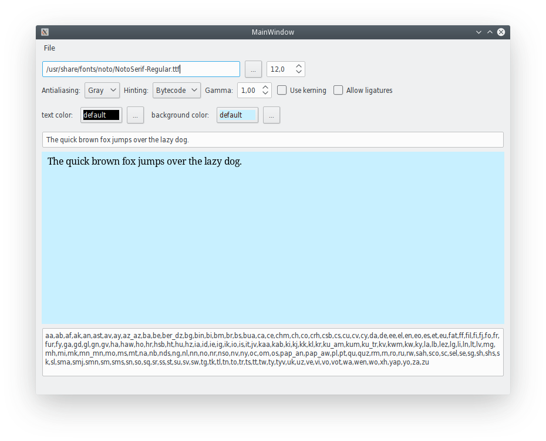
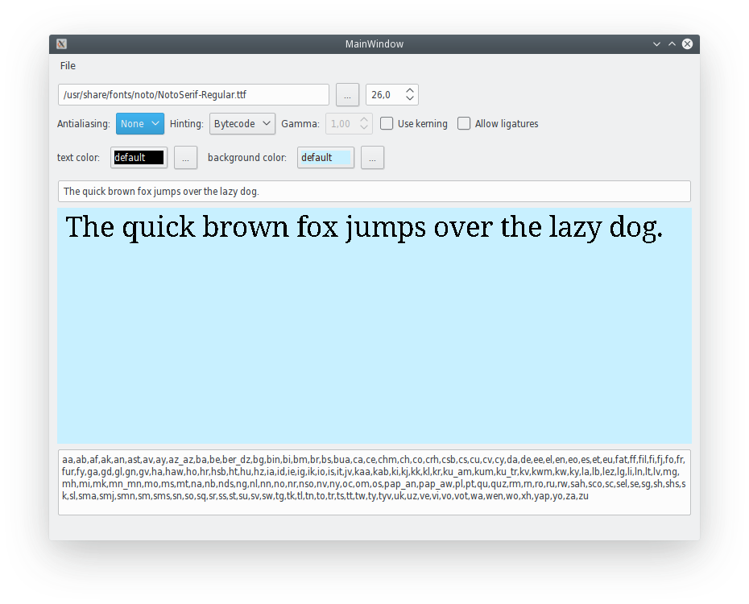
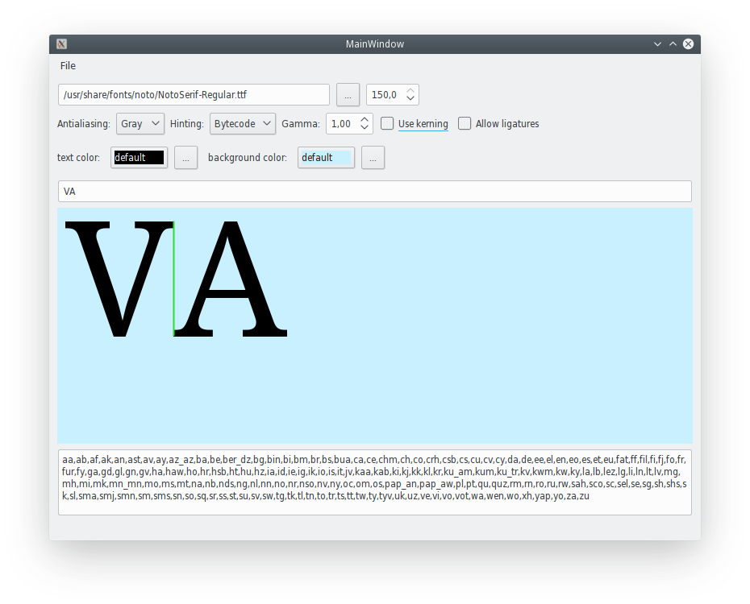
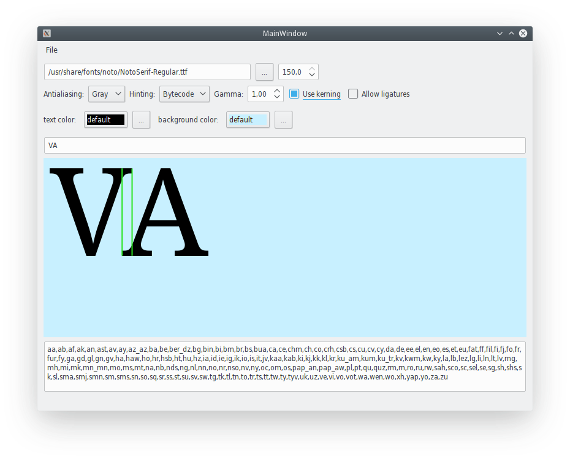
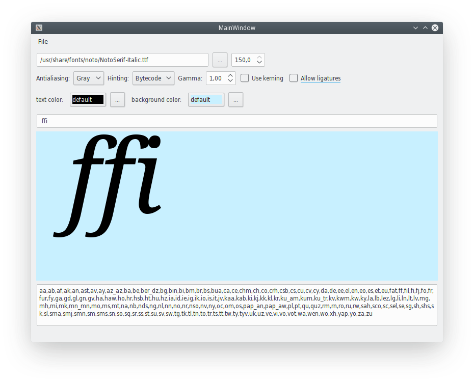
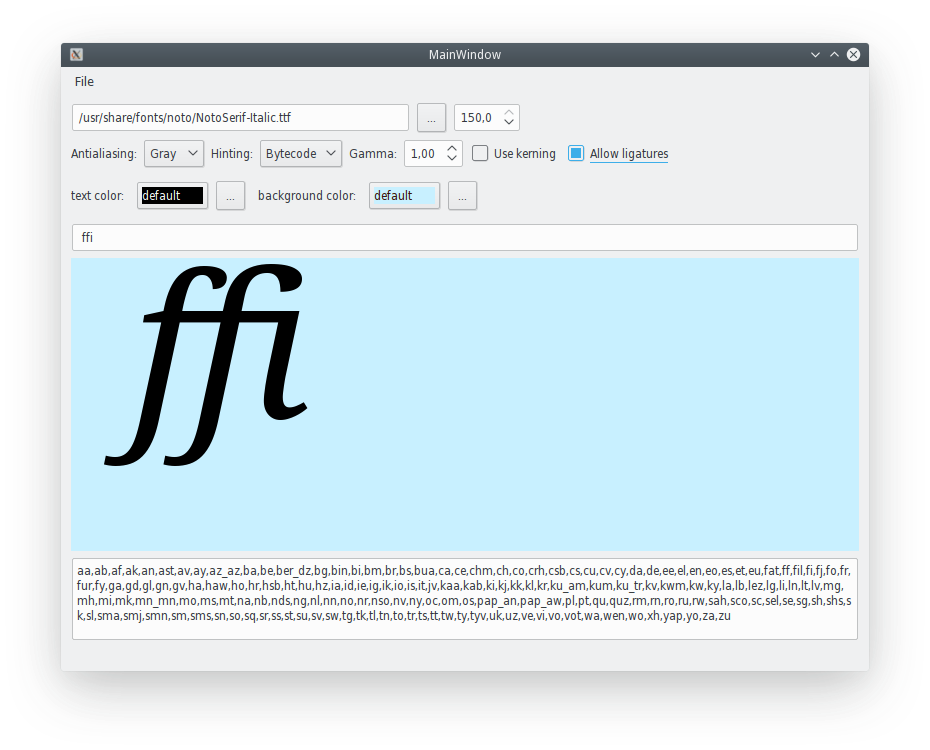

# freetype_textdraw demo program
freetype_textdraw is demo program developed to learch how to use library Freetype to draw any text. 

## Features
Draw some text with customizations:
* select font file to draw
* enable/disable kerning
* enabled/disable ligatures
* enable/disable text antialiasing
* enable/disable hinting
* change font size
* change gamma of antialiasing
* change text or background color

Please note that library HarfBuzz is required to implement ligatures and kerning.
Also for selected font you can see for wich languages there is a full set of glyphs.
<br/>
The most important: you can study sources of this project to write your own.

### LICENSE
All source codes are provided under the terms of GNU GPL license, version 3.

### Dependencies
cmake, Freetype, HarfBuzz (optional), Qt5.

### Build Instructions
Follow standard cmake build instructions:
* make build directory:
```bash
    # mkdir build
    # cd build
```
* call cmake to configure:
```bash
    # cmake -DCMAKE_BUILD_TYPE=Debug -DUSE_HARFBUZZ=ON ..
```
To omit HarfBuzz support replace "`-DUSE_HARFBUZZ=ON`" with "`-DUSE_HARFBUZZ=OFF`", but you lost ligatures and kerning features in modern fonts!
* call make to build:
```bash
    # make
```

### Screenshots
* Main window

* Antialiasing
  - Without antialiasing:

  - With antialiasing:

* Kerning
  - Kerning disabled:

  - Kerning enabled:

* Ligatures
  - Ligatures disabled:

  - Ligatures enabled:

